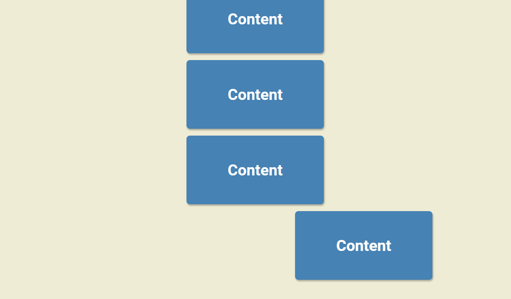

# Scroll Animation



## 🦉 Main information

Pretty simple Css/Js scroll animation.

The project goal:
- when the user starts scrolling, the sections of the site start to come in from the left and from the right
- use CSS transitions to have it come in smoothly
- use JavaScript to tell where the trigger point is for the next box to come in and add a specific class to show it
- set up in HTML, style it with CSS and add the functionality with JavaScript
  

## 🦊 Useful links to study
```
 https://developer.mozilla.org/en-US/docs/Web/API/Element/getBoundingClientRect
```

## ⚡ Built With
[HTML5](https://www.w3schools.com/html/) / [CSS3](https://www.w3schools.com/css/) / [JavaScript](https://www.w3schools.com/js/)